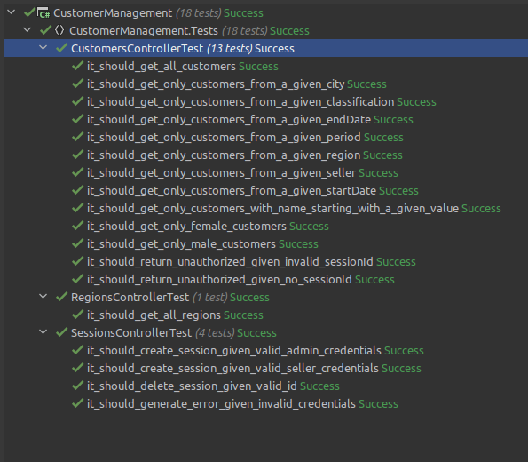
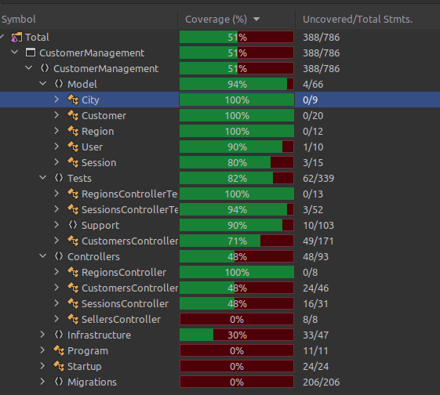

# CustomerManagement

## solution

Customer Management is a demo application that shows some simplicity over some complex and somehow recent
technologies.
The app was build using TDD as support to design routes and models.
The Restful/SPA combination had been chosen because the lightweight appeal, so instead of render all content (html/data) and send/receive from client to server and vice-versa.
The approach was code-first, so first the Model classes has been created, following by the minimal of entity framework to support the routes.

One possible approach should be using DDD like application, but DDD is heavy to keep.
So, for demo purpose, a pattern near MVC is best suitable.

The solution is not technical agnostic, it is coupled to dotnet, aspnet and entity framework.
So I built it within this restriction in mind. 

Customer Management was build using the following technologies:

### frontend
* react
* react-hooks
* react-redux

### backend
* C# 8
* dotnet core 3.1
* migrations
* sqlite
* xunit

## local build instructions

build a local docker image
```
docker build --tag customer_management .
```

execute the local docker image
```
docker run -p 5000:80 customer_management
```


## development instructions

requirements
* dotnet core 3.1

in order to create the dabase and connect to sqlite 
```
dotnet tool install --global dotnet-ef
dotnet ef database update
```

start the dotnet app from your IDE or by cli
```
dotnet run
```

start the react app from your IDE or by cli
```
cd wwwapp
npm start
```

that's all, have some fun

## todo
Some features is missing, due the reduced time to build this app.
Some aspects were prioritized, as tests, react-hooks and redux.

Missing:
* MD5 to hash passwords
* Date filters for search form

## highlights

### unit tests


### coverage



## warnings
This is not a production ready application, there is security lacks.
Using SPA/Restful without TLS/SSL is insecure.
And the proper way to handle auth stuff is about using middlewares, gateways and a well established protocol as Oauth.
The sqlite had been chosen given the portability but is not suitable for high loads.
